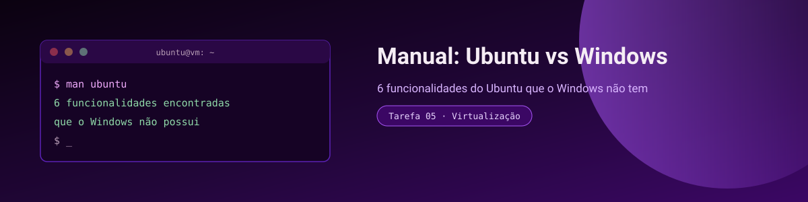
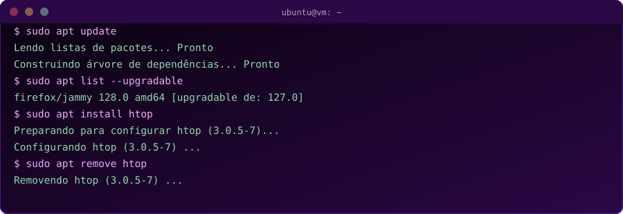
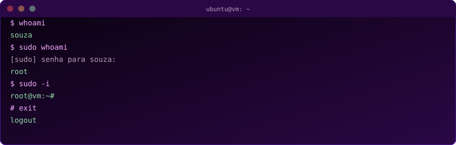
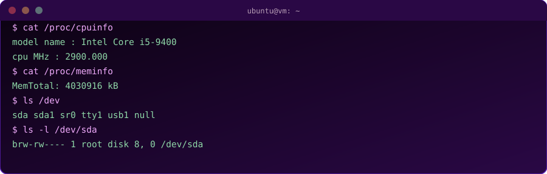
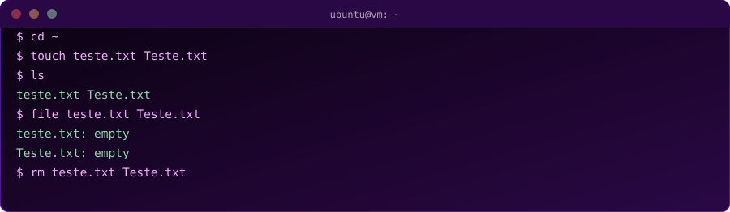
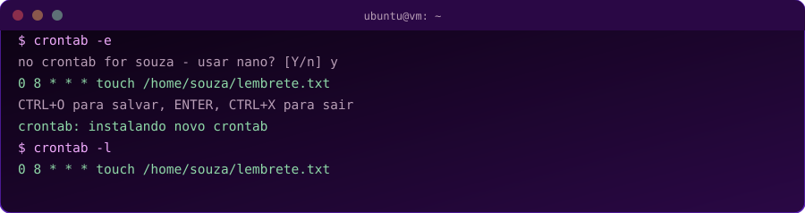
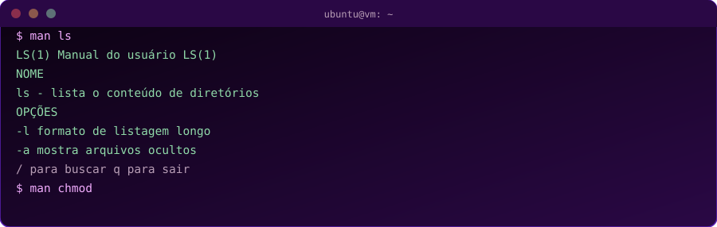

[manual-funcionalidades-ubuntu.md](https://github.com/user-attachments/files/31712834/manual-funcionalidades-ubuntu.md)
<p align="center">
  
</p>

<p align="center">
  
  
  
</p>

# Manual: Funcionalidades do Ubuntu que não existem no Windows

## Introdução

Este manual apresenta 6 funcionalidades do Ubuntu (Linux) que não existem, ou funcionam de forma bem diferente, no Windows. Cada seção traz pré-requisitos, o passo a passo completo, uma tela ilustrativa do terminal, o resultado esperado e problemas comuns na hora de testar.

**Antes de começar, tenha em mãos:**
- Uma máquina virtual com Ubuntu já instalada e ligada (VirtualBox)
- Acesso à internet dentro da VM (necessário para os passos com `apt`)
- A senha do seu usuário (pedida sempre que um comando usa `sudo`)

Para abrir o terminal a qualquer momento, use o atalho `Ctrl + Alt + T` ou procure por "Terminal" no menu de aplicativos.

---

##  Gerenciador de pacotes central (APT)

No Windows, cada programa é baixado de um site diferente, em formato `.exe`, e cada um tem seu próprio instalador. No Ubuntu, quase todo software vem de repositórios centrais, gerenciados por um único comando, que também resolve dependências automaticamente.

**Pré-requisitos:** VM conectada à internet.

**Passo a passo:**

1. Abra o terminal (`Ctrl + Alt + T`).
2. Atualize a lista de pacotes disponíveis nos repositórios:
   ```bash
   sudo apt update
   ```
3. Veja quais programas já instalados têm atualização disponível:
   ```bash
   sudo apt list --upgradable
   ```
4. Instale um programa de teste (um monitor de sistema leve, o `htop`):
   ```bash
   sudo apt install htop
   ```
   Quando perguntado `Deseja continuar? [S/n]`, digite `s` e pressione Enter.
5. Rode o programa recém-instalado:
   ```bash
   htop
   ```
   Pressione `q` para sair.
6. Remova o programa, para deixar o sistema como estava:
   ```bash
   sudo apt remove htop
   ```

<p align="center"></p>

**Resultado esperado:** o `htop` é instalado, abre uma tela colorida com o uso de CPU e memória em tempo real, e depois é removido sem erros.

**Problemas comuns:**
- `Não foi possível localizar o pacote` → rode `sudo apt update` antes de instalar.
- `Permissão negada` → falta o `sudo` no início do comando.

> 🟣 **Por que importa:** não existe download de site em site — tudo vem de um repositório confiável e centralizado.

---

##  Modelo de superusuário com `sudo`

No Windows, uma conta "Administrador" já tem os privilégios liberados o tempo todo (com uma confirmação pontual do UAC). No Linux, existe um usuário separado chamado **root**, e o usuário comum só ganha privilégios administrativos comando a comando, usando `sudo`.

**Pré-requisitos:** nenhum além do terminal aberto.

**Passo a passo:**

1. Descubra qual usuário está ativo no momento:
   ```bash
   whoami
   ```
2. Rode o mesmo comando, agora precedido de `sudo`:
   ```bash
   sudo whoami
   ```
   Digite sua senha quando pedido — **os caracteres não aparecem na tela, isso é normal**, apenas digite e pressione Enter.
3. Opcionalmente, abra uma sessão inteira como root:
   ```bash
   sudo -i
   ```
   Note que o prompt muda de `$` para `#`, indicando que agora tudo que você digitar roda como superusuário.
4. Saia da sessão root:
   ```bash
   exit
   ```

<p align="center"></p>

**Resultado esperado:** o primeiro `whoami` mostra seu usuário normal; com `sudo`, o resultado muda para `root`.

**Problemas comuns:**
- Senha errada → o terminal mostra `Sorry, try again.` e pede novamente.
- Usuário sem permissão de sudo → aparece `não está no arquivo sudoers`, nesse caso é preciso configurar isso como root pela primeira vez.

> 🟣 **Por que importa:** cada ação administrativa exige autorização explícita, comando por comando.

---

##  Filosofia "tudo é um arquivo"

No Ubuntu, até informações de hardware e processos em execução podem ser lidas como se fossem arquivos de texto comuns. Isso não existe no Windows.

**Pré-requisitos:** nenhum.

**Passo a passo:**

1. Leia as informações do processador direto de um "arquivo" do sistema:
   ```bash
   cat /proc/cpuinfo
   ```
2. Faça o mesmo para a memória RAM:
   ```bash
   cat /proc/meminfo
   ```
3. Liste os dispositivos conectados ao computador (discos, portas USB etc.):
   ```bash
   ls /dev
   ```
4. Veja os detalhes do disco principal, tratado como um arquivo especial:
   ```bash
   ls -l /dev/sda
   ```

<p align="center"></p>

**Resultado esperado:** informações reais de hardware aparecem como texto, e o disco em `/dev/sda` mostra permissões e tipo de arquivo especial (`b`, de "block device").

**Problemas comuns:**
- Nome do disco diferente (`/dev/vda`, `/dev/nvme0n1`) → depende do tipo de armazenamento virtual configurado no VirtualBox; rode `lsblk` para descobrir o nome correto.

> 🟣 **Por que importa:** hardware, processos e até a memória aparecem como arquivos dentro do sistema.

---

##  Sistema de arquivos sensível a maiúsculas e minúsculas

No Windows (NTFS padrão), `arquivo.txt` e `Arquivo.txt` são tratados como o mesmo arquivo. No Ubuntu, são dois arquivos completamente diferentes.

**Pré-requisitos:** nenhum.

**Passo a passo:**

1. Vá para a sua pasta pessoal:
   ```bash
   cd ~
   ```
2. Crie dois arquivos com o mesmo nome, mudando só a capitalização:
   ```bash
   touch teste.txt Teste.txt
   ```
3. Liste os arquivos da pasta:
   ```bash
   ls
   ```
4. Confirme que são dois arquivos distintos:
   ```bash
   file teste.txt Teste.txt
   ```
5. Limpe os arquivos de teste:
   ```bash
   rm teste.txt Teste.txt
   ```

<p align="center"></p>

**Resultado esperado:** o comando `ls` mostra os dois arquivos lado a lado — no Windows, o segundo `touch` teria apenas sobrescrito o primeiro.

**Problemas comuns:**
- Se só aparecer um arquivo, você provavelmente está numa pasta compartilhada montada com um sistema de arquivos do Windows (ex: pasta compartilhada do VirtualBox) — teste dentro da pasta pessoal do Ubuntu (`~`).

> 🟣 **Por que importa:** o sistema distingue letras maiúsculas de minúsculas em qualquer nome de arquivo.

---

##  Agendamento de tarefas nativo com `cron`

O Windows precisa do "Agendador de Tarefas", um programa à parte com interface gráfica. No Ubuntu, o agendamento de tarefas (`cron`) já vem embutido no sistema desde sempre, e pode ser configurado só por linha de comando.

**Pré-requisitos:** nenhum.

**Passo a passo:**

1. Abra o editor de tarefas agendadas do seu usuário:
   ```bash
   crontab -e
   ```
   Se for a primeira vez, o sistema pergunta qual editor usar — digite `1` para escolher o `nano` (mais simples).
2. No final do arquivo que abrir, adicione a linha abaixo, que cria um arquivo todo dia às 8h da manhã:
   ```
   0 8 * * * touch /home/$USER/lembrete.txt
   ```
3. Salve e feche: pressione `Ctrl + O`, depois `Enter` para confirmar o nome do arquivo, e `Ctrl + X` para sair.
4. Confira se a tarefa foi salva:
   ```bash
   crontab -l
   ```

<p align="center"></p>

**Resultado esperado:** o comando `crontab -l` mostra a linha que você adicionou, confirmando que a tarefa está agendada no sistema.

**Problemas comuns:**
- Editor `vi`/`vim` abriu sem querer e você não sabe sair → digite `:q!` e pressione Enter, depois rode `crontab -e` de novo e escolha o `nano`.

> 🟣 **Por que importa:** agendamento nativo do sistema, sem instalar nenhum programa extra.

---

##  Páginas de manual (`man`) para qualquer comando

No Windows, a documentação de um comando costuma exigir uma busca no navegador. No Ubuntu, praticamente todo comando do sistema já vem com um manual completo embutido, acessível offline, direto no terminal.

**Pré-requisitos:** nenhum.

**Passo a passo:**

1. Abra o manual do comando `ls`:
   ```bash
   man ls
   ```
2. Navegue pelo texto usando as setas do teclado, ou `espaço` para avançar uma página inteira.
3. Busque por uma palavra específica dentro do manual digitando `/` seguido do termo, por exemplo `/oculto`, e pressione Enter.
4. Saia do manual pressionando `q`.
5. Repita o processo para outros comandos, por exemplo:
   ```bash
   man chmod
   man cp
   ```

<p align="center"></p>

**Resultado esperado:** um manual completo é aberto em tela cheia dentro do próprio terminal, com nome do comando, descrição e todas as opções disponíveis.

**Problemas comuns:**
- Página não sai com `q` → confirme que o foco está no terminal (clique nele) antes de digitar.

> 🟣 **Por que importa:** documentação completa e offline para quase qualquer comando do sistema.

---

## Conclusão

Essas 6 funcionalidades mostram como o Ubuntu tem uma filosofia diferente do Windows: mais centrada em terminal, em arquivos de texto simples e em ferramentas nativas do sistema, ao invés de programas gráficos separados para cada tarefa. Todas podem ser testadas em poucos minutos em uma máquina virtual, seguindo o passo a passo de cada seção.

<p align="center"><sub>🖤 Manual produzido para a Tarefa 05 — Virtualização e Sistemas Operacionais</sub></p>
